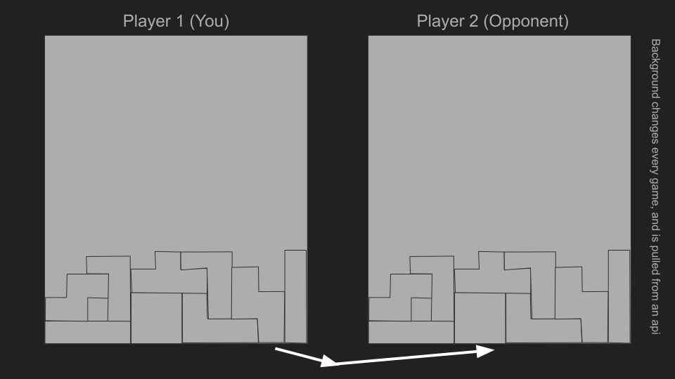
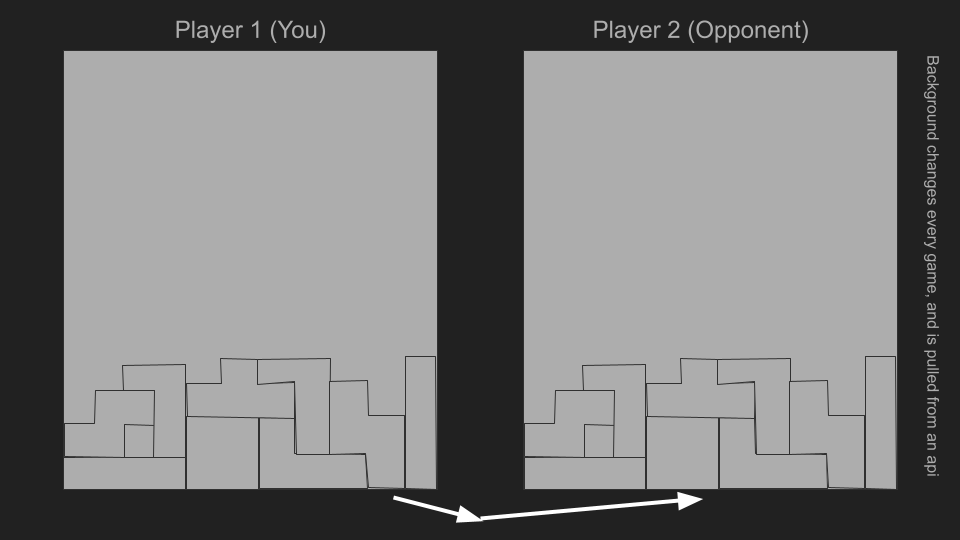

# Tetris Dual

### Elevator Pitch

My app will let 2 people play the classic game of Tetris but this version you get to play aginst each other in real time. When one player completes a row by filling it all the way up horizontaly, then that row is sent to the player, leading them to run out of space faster. High scores will be kept by the central server, allowing everyone to compete for the top place.

### Sketches

<!--  -->

### How I will use technologies

* HTML: Basic web interface layout
* CSS: Styling the blocks and anamating the movements and the background
* JavaScript: The timing, and the logic for the falling blocks
* React: Orginizing all the diffrent front end components to all work together
* Web Service: I will have a background behind the game that will be pulled using an api library of images to encourage competition
* Authentication: Have a login and a set of user accounts to keep track of high scores
* Database: A storage of logins and user info, also high scores
* WebSocket: The row that the opponent just completed will be pushed to the client by use of websockets

## Deliverable: HTML

* For this deliverable I made 4 pages, all single html files.
    * my main login page
    * My main game page
    * My Leaderboard Page
    * My contact page
* On the login page, I have the login logic, as well as buttons and navigation to the other pages
* The play.html page is the one I spent the most time on getting flex to work at a basic level, but the canvases still do not auto resize
* For Web Service: I will have a background behind the game that will be pulled using an api library of images to encourage competition
* For WebSocket: The row that the opponent just completed will be pushed to the client by use of websockets

## Deliverable: CSS

* I modified my 4 html files using embeded CSS
    * my main login page
    * My main game page
    * My Leaderboard Page
    * My contact page
    * The background image is a gif that will animate and stretch to fit the screen.
    * The blocks are all styled using flexbox
* I also added some example data to the leaderboard page, but it is not being pulled from the database

## Deliverable: React

* I made a structure very simular to the example simon code that was given in class.
    * My main login page
    * My main game page
    * My Leaderboard Page
    * My about page
* My game page compleately is usable for playing a full single player game of Tetris
    * I coded up tetris from scratch in Javascript, then ported it over to use in react
    * The react version on my game uses React hooks to update certian states
* My github link is easily found on the nav bar
* I have 4 pages all being routed by a React router
* Everything is compiled using Vite

## Deliverable: Service

* I am using express in my index.js file to serve my static files as well as my http backend end points

* I am using a walpaper api to set the wallpaper dynamicly (WIP)
* My frontend calls those endpoints
* I am also using mongo db to store all the data for users and scores

## Deliverable: Login

* I am using bcrypt to hash passwords before storing them inside of mongo db.
* My program supports new user regrestration and authentication, as well as supporting existing users as well.
* I am using Mongo DB running in a docker contianer as my service's database for storing and retreving credentials as well as leaderboard scores.
* I am also using json web tokens to keep track of the user's session.
* I am using react router to route to different pages based on the user's session status whether loged in or loged out. 
    * If not loged in, then the user is not able to access the play page

## Deliverable: WebSocket

* I am using a combination of http and websocket to play multiplayer tetris games
* My program supports joining games and listing multiple games to join
* It also supports streaming the entire game board to another user using websocket